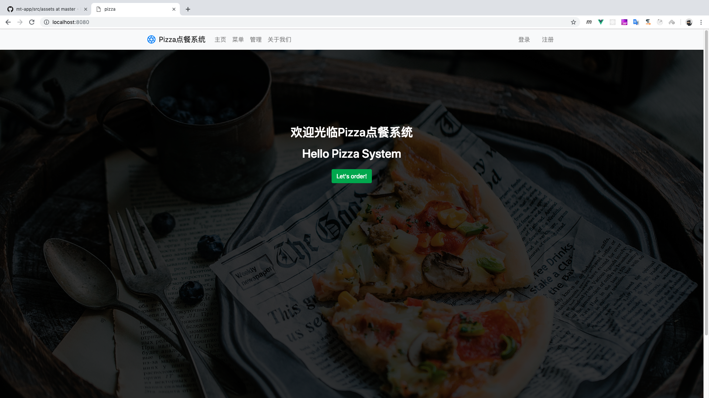
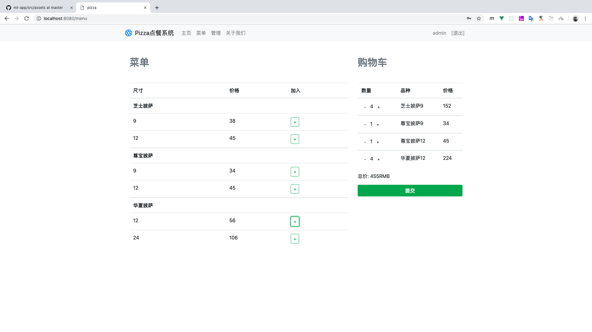
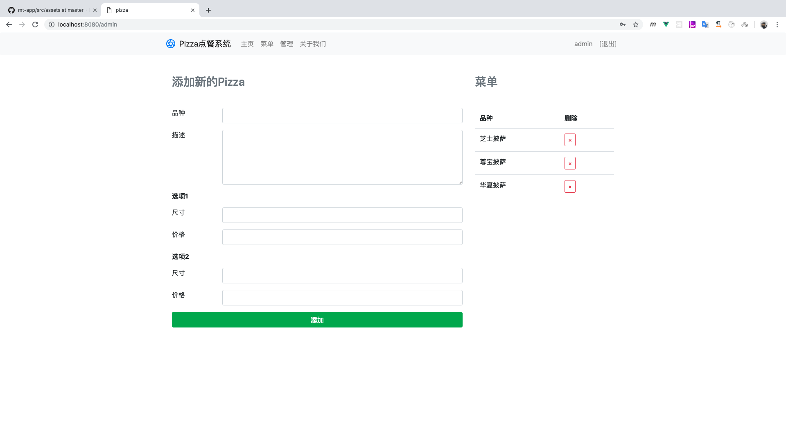
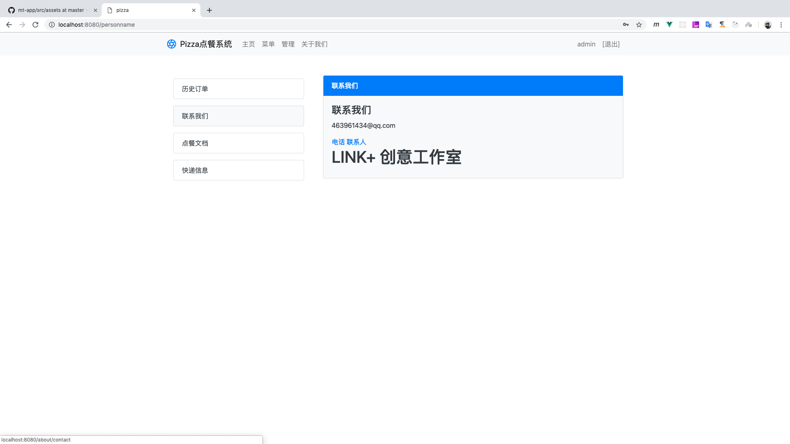
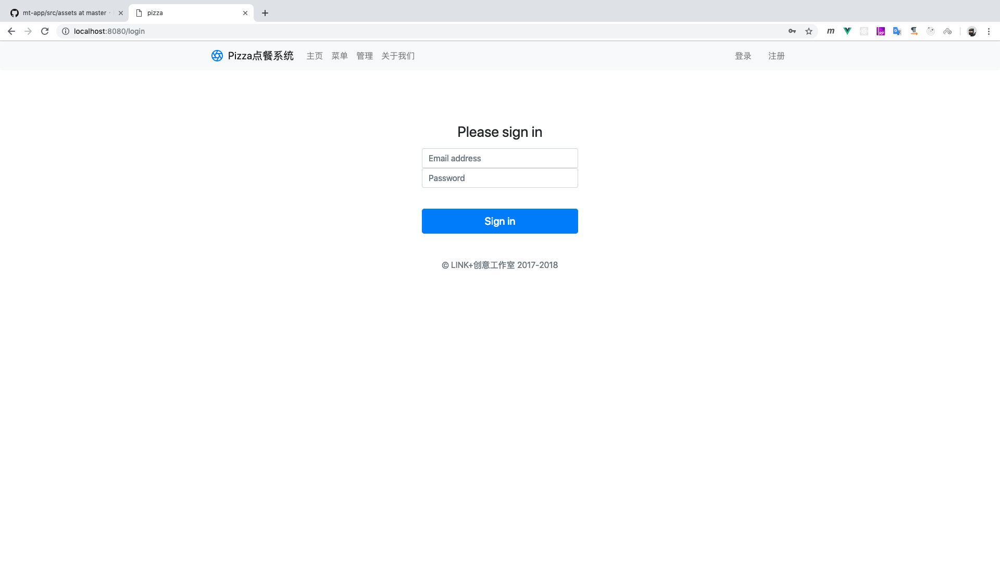
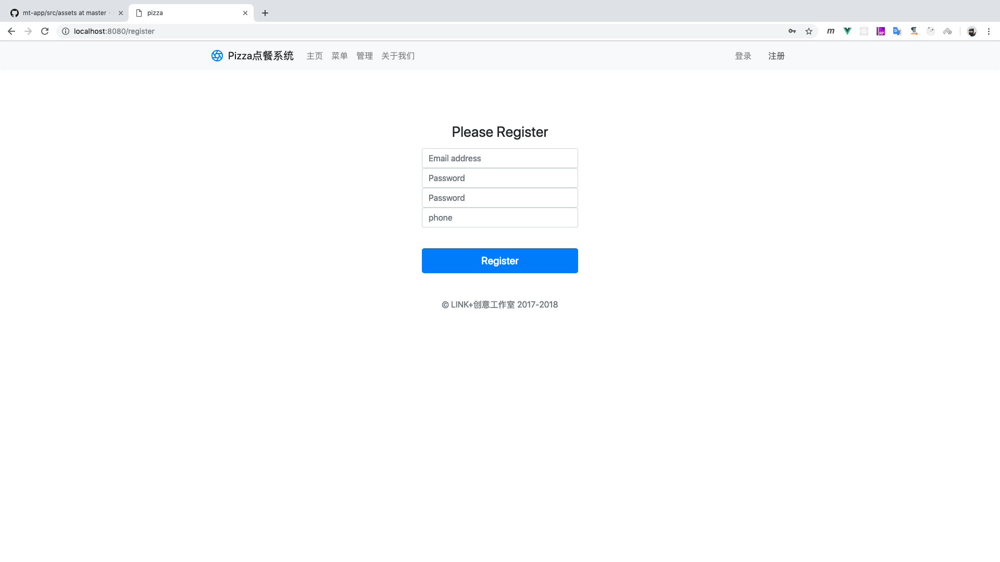

# pizzaOrder System 披萨点餐系统

> Vue + JsonServer web application

> UI








> bash

``` 
# Project start
$ npm run dev

# JsonServer start
$ json-server --watch ./local/db.json

```
> files

```
    .
    ├── README.md
    ├── build
    │   ├── build.js
    │   ├── check-versions.js
    │   ├── logo.png
    │   ├── utils.js
    │   ├── vue-loader.conf.js
    │   ├── webpack.base.conf.js
    │   ├── webpack.dev.conf.js
    │   └── webpack.prod.conf.js
    ├── config
    │   ├── dev.env.js
    │   ├── index.js
    │   └── prod.env.js
    ├── index.html
    ├── local
    │   └── db.json
    ├── lookImg
    │   ├── 1.png
    │   ├── 2.png
    │   ├── 3.png
    │   ├── 4.png
    │   ├── 5.png
    │   └── 6.png
    ├── package-lock.json
    ├── package.json
    ├── src
    │   ├── App.vue
    │   ├── assets
    │   │   └── banner.jpg
    │   ├── components
    │   │   ├── Admin.vue
    │   │   ├── Header.vue
    │   │   ├── Home.vue
    │   │   ├── Login.vue
    │   │   ├── Menu.vue
    │   │   ├── NewPizza.vue
    │   │   ├── Register.vue
    │   │   └── about
    │   │       ├── About.vue
    │   │       ├── Contact.vue
    │   │       ├── Delivery.vue
    │   │       ├── History.vue
    │   │       ├── OrderingGuide.vue
    │   │       └── contact
    │   │           ├── PersonName.vue
    │   │           └── Phone.vue
    │   ├── main.js
    │   ├── routes.js
    │   └── store
    │       ├── module
    │       │   ├── menu.js
    │       │   ├── status.js
    │       │   └── users.js
    │       └── store.js
    └── static

    12 directories, 44 files

```


Copy right displayli 转载请加备注 或 联系 QQ：463961434
 
Author By displayLi @ [LINK + 创意工作室](http://www.link97.com)
